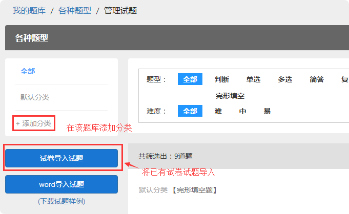
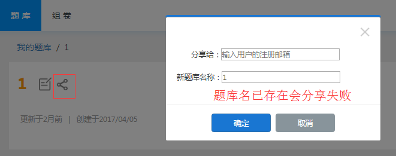
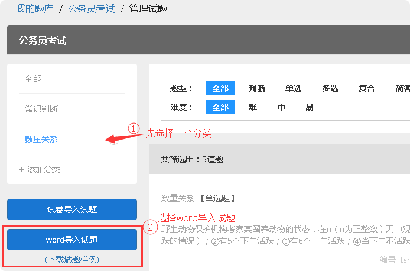
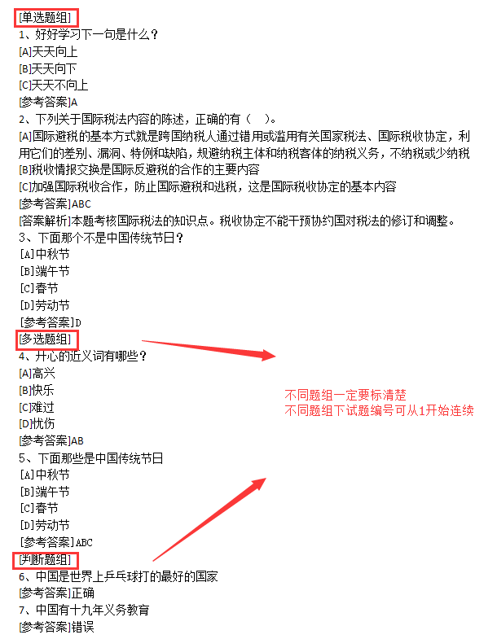

# 题库管理
----------

## 题库有什么用途？ ##

题库可以用来储存大量试题，建议将试题按照科目、知识点等分类放在不同的题库或者分类中，方便日后组卷和制作试卷时导入试题。

1. 题库里的试题可以在编辑试卷时直接添加到试卷

2. 将已经制作好的试卷，可以将试卷里的试题导入到题库

3. 组卷时可以从题库里随机抽取试题

## 如何创建题库、添加试题？ ##

方法一：创建题库后选择从试卷导入题库，选择需要导入的试卷后，可选择默认分类或按大题名称自动分类，导入完成后点击“确认”。 

方法二：手动编辑试题加入题库，点击“创建试题”，选择题型完成编辑。 

方法三：按照给出的试题样例编辑word文档导入试题（导入规则要求严格，请仔细检查）

**注：**在“管理试题”界面，左侧栏可自主添加分类，添加分类后，将您所需的试题导入，更方便搜索。

# 添加试题
----------

* [题库里可以添加哪些类型的试题？](#题库里可以添加哪些类型的试题？)
* [从试卷导入题库如何分类？](#从试卷导入题库如何分类？)
* 
## 题库里可以添加哪些类型的试题？ ##

* 判断

* 单选

* 多选

* 复合（即资料分析题）

* 简答

* 填空

* 录音题

* 拖拽题

* 完形填空题

所有类型的试题均支持上传音频和图片；

其中简答、填空和录音题需要人工判分；判断、单选和多选题必须设置正确答案；

复合题增加下设小题请点击“+新增子试题”并选择需要的题型。

## 从试卷导入题库如何分类？ ##

从试卷导入题库时，可以选择导入到指定分类或者按大题名称自动分类；

1. 如果指定分类，则导入试卷里的所有试题放入到此指定分类；

2. 按照大题名称自动分类，则按照试卷中的答题名称自动分类，如果不存在对应的分类，系统会根据大题名称自动创建分类并导入。

**注：**按照一套试卷或一个科目所需要的试题来创建不同的题库，或者在题库中添加多个分类，这样在编辑试卷时，从题库导入试题会更加便捷哦~

# 题库分享
-------------

题库分享是将一个题库分享给其他账户使用的便捷方式；可以将我的账户下面的题库分享到别人账号下。

**方法： **在我的题库里选择一个题库，选择分享，填写对方用户的注册邮箱并填写一个新的题库名，确认分享后此用户便可以拥有并使用该题库。

# 文档导入试题 #
----------

使用word文档导入试题步骤如下：管理试题—选择一个分类（或添加分类）—WORD导入试题—选择文档

Word导入试题到题库虽然便捷，但是对于文档里试题编辑的格式要求很是严格，需要严格按照试题样例更改试题格式!

点击下载试题样例[Word导入试题模板](https://static.eztest.org/static/content/category/img/WORD试题导入样例.docx?_version=46)

**WORD导入题库注意事项：**

1. 多个相同题型可以设置[单选题组][多选题组][判断题组][简答题组][填空题组][录音题组]，一个题组下面题号必须连续，格式如：1、2、3、**不可自动编号**。

2. [难度:0.7][分数:1]可省略（省略后使用默认难度0.5，分数为1）、[答案解析]若没有可省略。

3. 难度等级设置数值越大越容易，具体对应如下（如文档没有难度说明，默认是中）：难：0.2；中：0.5；易：0.9。

4. 填空题中使用四个连续下划线____表示需要填写内容的空缺，有多少空缺，后续就要有多少个[参考答案]标签。

5. **重要！** 请保证全文均为**半角字符**，可以用word选取全文然后转换为半角即可。

6. **仅支持DOCX后缀格式**，DOC无法进行解析。

**题组导入题库注意事项：**

- 1. 所有题号不可自动编号；
- 2. 保证整篇文档题号从1开始连续（或每个题组下从1开始连续）
- 3. 判断题答案只能写[正确]或[错误]
- 4. 不同题型前一定要写清楚

样式如下：

**注：**由于Word导入试题格式要求严格，易出错，如需帮助请QQ咨询。
