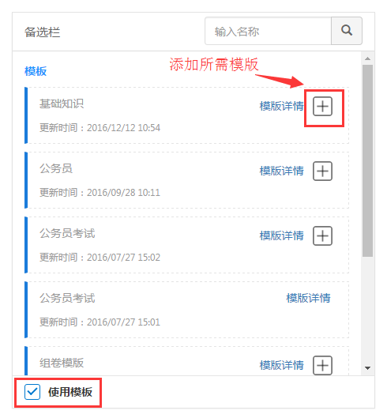
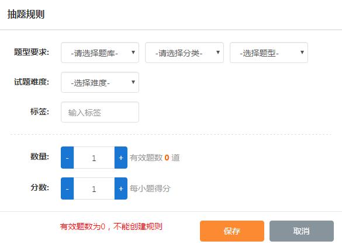
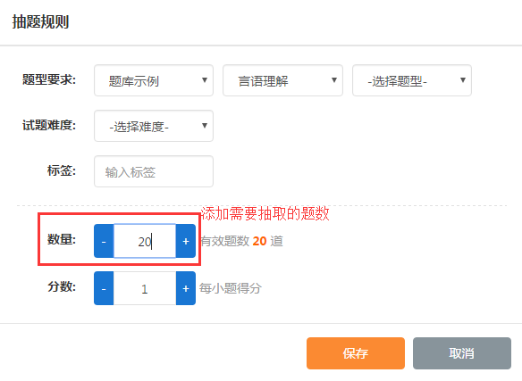
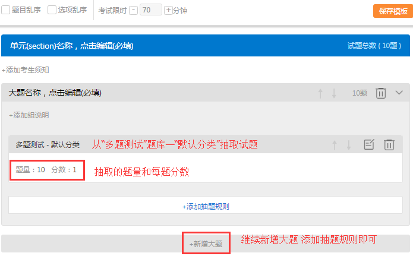
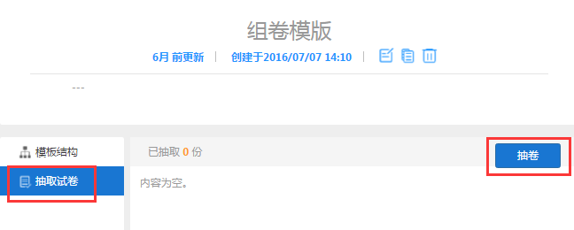

# 组卷模板
----------

* [什么是组卷模板，如何组卷？](#什么是组卷模板，如何组卷？)
* [组卷的具体操作步骤](#组卷的具体操作步骤)

## 什么是组卷模板，如何组卷？ ##

1. 组卷模板可以实现自动从题库中抽取试题，组成试卷的任务。组卷模板跟试卷类似，但是不包含任何实际的试题，而是包含一组规则，定义了如何从题库中抽取试题。

2. 使用组卷模板的前提是题库已经建立好，并且需要在题库里有足够可供选择的试题，题库里的试题越多，使用组卷形成的试卷的试题重复率就越低。

3. 组卷的步骤和应用：首先需要创建组卷模版，编辑好模版结构，并添加好抽卷规则。

4. 通过模板可以单独抽取试卷；也可以在考试中直接使用模版作为考试的试卷，以达到考生随机抽题的目的。

5. 使用模版的方法：创建考试，添加试卷时勾选“使用模版”，选择所需要的模板，考生考试将会从该模版随机抽题组卷。

**1.组卷模板：**通过定义抽题规则来从题库抽取试题进行组卷。模板包含试卷的单元名称，大题名称和大题下设的小题类型和数量。

**2.抽题规则：**可以设置题型要求，选择题库、分类、题型；选择试题难度、标签；设置该种抽题规则的数量，和每小题得分；特别注意注意所选题库里复合题所包含的小题数量和题型是否一致，否则使用模版作为试卷后，考生抽到的试卷总分和体量会不一致。

**一.设置题型要求：**

1. 选择所需的题库；
2. 进一步选择题库里的分类；
3. 最后选择你所需要的题型;

**二. 选择试题难度、标签可进一步筛选所需要的试题，若不需要也可以不设置；**

**三. 设置抽取该类试题的数量，和每小题得分；**

**特别注意：**所选题库里复合题所包含的小题数量和题型是否一致，否则使用模版作为试卷后，考生抽到的试卷总分和体量会不一致。

## 组卷的具体操作步骤 ##

**一.新建模版:**编辑模板结构

**二. 编辑模版：**按照需要的试卷模版来完成模版的编辑，编辑好单元名称和大题名称，在每道大题下添加抽题规则，即设置每道大题内所包含的小题类型。

# 抽卷
----------

新建模版——完成模版编辑——抽取试卷

**注：**抽取试卷后会放在我的试卷里。抽取到的试卷和普通试卷一样，可以进一步修改编辑。

